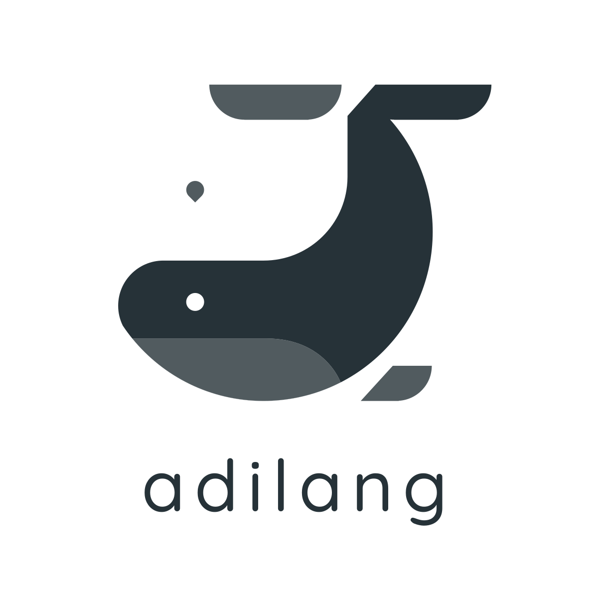

#  AdiLang

[](https://golang.org)
[](https://opensource.org/licenses/MIT)

A minimalist toy programming language built with ❤️ in Go. Modern syntax meets playful experimentation.

---

## 🚀 Features

<div align="center">

| **Feature**               | **Syntax Example**                          |
|---------------------------|---------------------------------------------|
| **🛠️ Variables**          | `var(name = "AdiLang")`                     |
| **📜 Literals**            | `42` (number), `"hello"` (string)           |
| **💬 Comments**            | `// Single-line`<br>`% Multi-line %`        |
| **🖨️ Print Statements**   | `out->"Hello World!"`                       |
| **🌀 Loops**               | `fordude i in range(5) { ... }`             |

</div>

---

## 📚 Syntax Guide

### Variables & Literals
```adilang
// String variable
var(greeting = "Hello, AdiLang!")

// Number variable
var(answer = 42)

// Print combined values
out->greeting + " The answer is: " + answer

// Control flow
// Simple for loop
fordude i in range(3) {
    out->"aditya"
}

%
Output:
aditya
aditya 
aditya
%
```

## Installation Guide 

### Clone repository
```
git clone https://github.com/your-username/adilang.git
cd adilang
```
### Build interpreter
```
go build -o adilang
```
### Run sample program
```
./adilang hello.adi
```

